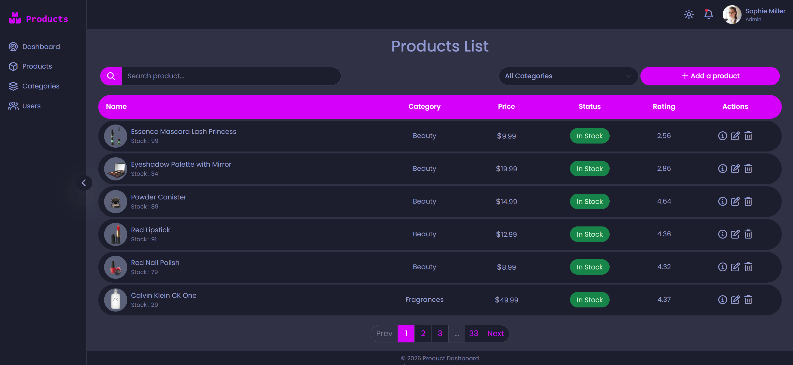

# Product Dashboard

A responsive product management dashboard built with HTML, CSS, JavaScriptو Vanilla JavaScript and Bootstrap.  
This project interacts with the [DummyJSON API](https://dummyjson.com) to fetch products and categories, and demonstrates frontend CRUD operations in a simulated environment.

## Live Demo

🔗 **View Online:**  
https://dorsa-piraneh.github.io/product-dashboard/

## Screenshots / Demo



## Features

- Fetching products from a REST API (DummyJSON)
- Product listing with pagination
- Search products with **debounce** to optimize API requests
- Filter products by category
- Add, edit, and delete products (simulated with dummy API)
- Loading indicator while fetching data from API
- Graceful error handling with user-friendly alerts
- Product details modal with image carousel
- Responsive sidebar with collapse/expand functionality
- Light / Dark theme switcher (saved in localStorage)
- Toast and modal alerts using SweetAlert2
- Fully responsive layout (desktop, tablet, mobile)

## ⚠️ Notes

- **API Limitations :**
  - Searching can only be performed on the currently fetched page of products.
  - The API does **not** support combining category filtering with search.
- **Simulated CRUD operations :**
  - Add, edit, and delete actions are simulated and do not persist on a real backend.
  - The dashboard communicates with the DummyJSON API for demo purposes only.

## Installation & Usage

### Option 1: Run Locally (No Git Required)

1. Download the project as ZIP.
2. Extract the files.
3. Open `index.html` in your browser.

### Option 2: Clone with Git

```bash
git clone https://github.com/dorsa-piraneh/product-dashboard.git
```

Then open `index.html` in your browser.


## Project Structure

```txt
ProductDashboard/
│   index.html
│   README.md
│
├───assets
│   ├───fonts
│   │   └───Poppins
│   │
│   ├───icons
│   │   └───FontAwesome
│   │
│   ├───images
│   │
│   └───libs
│       ├───bootstrap
│       └───sweetalert2
│
├───css
│       main.css
│
└───js
        main.js
```

## Technologies Used

- HTML5 & CSS3
- Vanilla JavaScript (ES6+)
- Bootstrap 5
- SweetAlert2
- FontAwesome Icons
- LocalStorage API

## Future Improvements

- **Sorting products** : Add sorting by price, rating, or stock status.

## Author

**Dorsa Piraneh**  
GitHub: https://github.com/dorsa-piraneh

